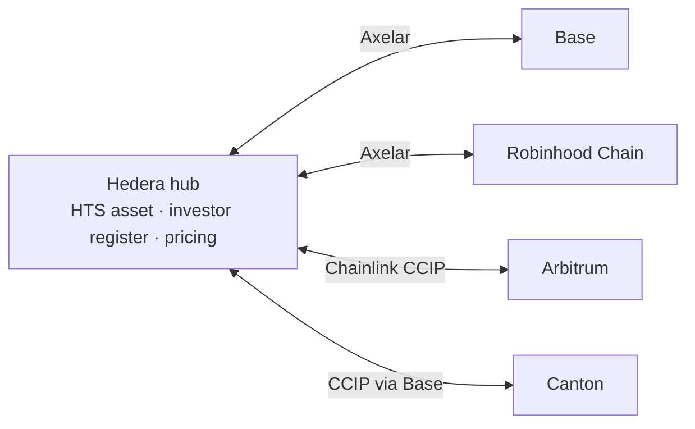

# Atollway

Issue a tokenized asset on Hedera, hold it on other major chains, and keep compliance, pricing and payouts on Hedera.

Atollway is a [Scaffold-HBAR](https://docs.hedera.com/solutions/tools/scaffold-hbar) template for tokenized funds, bonds and other real-world assets that live on more than one chain.

> **Status:** in development. The design is complete and the contracts are being built. See the [roadmap](docs/roadmap.md).

## Why Atollway

Tokenized assets are often issued on several chains at once. Each copy then needs its own allowlist, its own payouts and its own pricing, and the copies drift apart. Atollway keeps a single source of truth on Hedera:

- **Compliance follows the token.** Approve, freeze or revoke an investor once on Hedera, and every chain enforces it.
- **One supply.** Shares move between Hedera and other chains without being duplicated, and the amount on each chain is capped.
- **Servicing from one place.** Pricing and payouts run on Hedera, with fixed, low fees and scheduled execution.

## How it works



1. The issuer creates the asset on Hedera as a Hedera Token Service token, with network-enforced KYC, freeze and pause controls.
2. Approved investors subscribe with HBAR at the issuer's net asset value, priced with the Chainlink HBAR/USD feed.
3. Investors move shares to another chain. The hub burns them on Hedera and the spoke on that chain mints a mirror token at the same address.
4. Every compliance decision made on Hedera is sent to every spoke over Axelar or Chainlink CCIP, so the rules are the same everywhere.

The [architecture document](docs/architecture.md) covers the components, message flows, trust model and failure modes. [Chain coverage](docs/chains.md) lists the chains a spoke can run on, and the [decision records](docs/adr/README.md) explain why the design looks the way it does.

## Getting started

Atollway is not released yet. Once it is, create a project from it with:

```bash
npm create scaffold-hbar@latest -- --template MukulKolpe/atollway
```

## Development

You need Node.js 22 (`nvm use` picks it from `.nvmrc`), Yarn, [Foundry](https://getfoundry.sh) and Git.

```bash
git clone --recurse-submodules https://github.com/MukulKolpe/atollway.git
cd atollway
yarn install
yarn foundry:test       # contract tests
yarn foundry:simulate   # the hub on Hedera testnet, without spending HBAR
yarn next:dev           # frontend at http://localhost:3000
```

[CONTRIBUTING.md](CONTRIBUTING.md) lists every command and explains how changes are proposed and reviewed.

## Documentation

| Document | What it covers |
| --- | --- |
| [Architecture](docs/architecture.md) | Components, message flows, trust model, failure modes |
| [Decision records](docs/adr/README.md) | Why the design looks the way it does |
| [Chain coverage](docs/chains.md) | Where spokes can run, with testnet bridge addresses |
| [Roadmap](docs/roadmap.md) | Milestones and their status |
| [Changelog](CHANGELOG.md) | What changed, release by release |

## Security

The contracts are unaudited. Report vulnerabilities privately as described in [SECURITY.md](SECURITY.md).

## License

[MIT](LICENSE)
