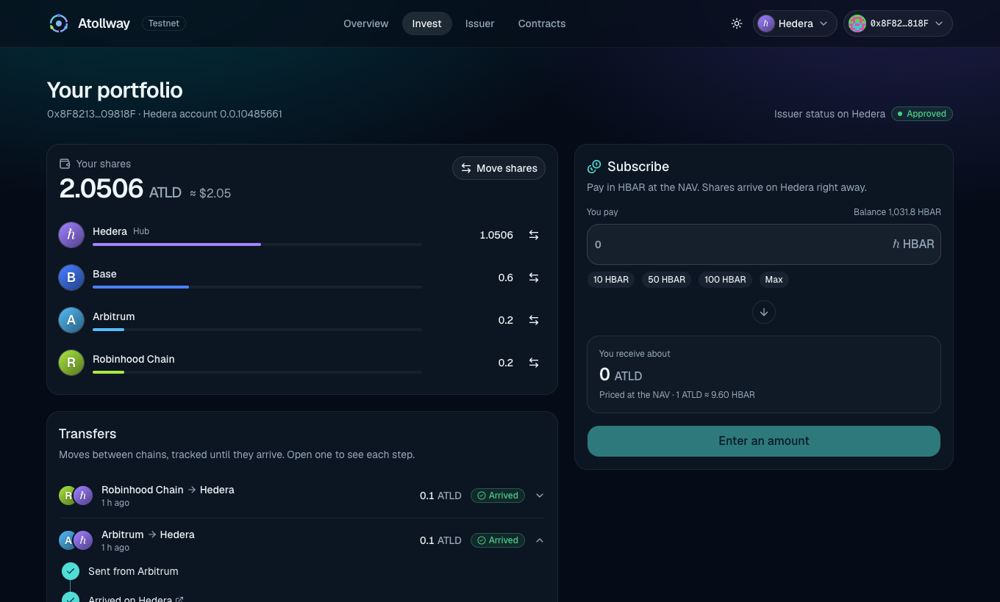

# The app

The Next.js app in `packages/nextjs` is how investors and the issuer use Atollway. It reads every chain directly from the browser and has no backend of its own. Start it with `yarn next:dev` and open http://localhost:3000.



## Pages

| Page | For | What it does |
| --- | --- | --- |
| `/` Overview | Everyone | The hub and its spokes on a live map, total supply split by chain, the NAV and the Chainlink HBAR price, and the hub's latest events. |
| `/invest` | Investors | Setup (a Hedera account, linking the token, approval), subscriptions in HBAR, holdings on every chain, moving shares between chains and tracking each transfer until it lands. |
| `/issuer` | The issuer | Approving, freezing and revoking investors, spoke caps and resending approvals, the NAV, price freshness, where proceeds go, and the pause switch. Anyone can view it; only the hub's owner can act. |
| `/debug` | Developers | Scaffold-HBAR's contract debugger, for each chain. |

## Where the data comes from

| Data | Source |
| --- | --- |
| Hub state, Hedera balances and fee quotes | Contract reads on Hedera through the JSON-RPC relay, batched with Multicall3 |
| Spoke state and balances | Contract reads on each spoke chain |
| The hub's events: activity, transfers and investor decisions | Hedera mirror node |
| Accounts that linked the token, and Hedera account IDs | Hedera mirror node |
| Where a message is on its bridge | [Chainlink's CCIP API](https://docs.chain.link/ccip/tools/api) and the [Axelarscan API](https://docs.axelarscan.io) |
| Whether a transfer arrived | `minted(transferId)` on the spoke, or `released(transferId)` on the hub |

Contract addresses and ABIs come from `contracts/deployedContracts.ts`, which `yarn foundry:deploy` writes.

## Transfers

A transfer leaves one chain in a single transaction and lands on the other when its bridge delivers it. The investor portal shows each one as a timeline: the source transaction, the source chain finalizing, the bridge delivering (twice for a relayed route) and the arrival. Most of the wait is finality: about a minute from Hedera, and 15 to 45 minutes from the spoke testnets.

The hub records a transfer to a spoke when it leaves Hedera, and a transfer to Hedera when it arrives, so the mirror node lists both directions. While a transfer to Hedera is still on its bridge, only the browser that sent it knows about it, so the app keeps the transfers you send in local storage. A transfer sent from another device appears once it lands.

## Fees and units

Inside the Hedera EVM, `msg.value` and the hub's fee quotes are in tinybars (8 decimals), while wallets and the JSON-RPC relay use 18 decimals. The app multiplies the hub's quotes by 10^10 before sending them as a transaction value, and keeps HBAR amounts to 8 decimals. Spokes quote in wei. Every bridge fee is sent with a 10% margin, because fees can rise between quoting and signing, and the hub and the gateways refund what is not used.

## Configuration

| File | What it holds |
| --- | --- |
| `scaffold.config.ts` | The networks the wallet can use, their RPC URLs, and the WalletConnect project ID |
| `atollway.config.ts` | Each chain's name, colour and faucet; each spoke's relay chain and typical delivery times; the mirror node URL |
| `styles/globals.css` | The theme: colours for light and dark mode, including one per chain |

| Environment variable | Default |
| --- | --- |
| `NEXT_PUBLIC_HEDERA_TESTNET_RPC_URL` | `https://testnet.hashio.io/api` |
| `NEXT_PUBLIC_BASE_SEPOLIA_RPC_URL` | `https://sepolia.base.org` |
| `NEXT_PUBLIC_ARBITRUM_SEPOLIA_RPC_URL` | `https://sepolia-rollup.arbitrum.io/rpc` |
| `NEXT_PUBLIC_ROBINHOOD_TESTNET_RPC_URL` | `https://rpc.testnet.chain.robinhood.com` |
| `NEXT_PUBLIC_HEDERA_MIRROR_NODE_URL` | `https://testnet.mirrornode.hedera.com` |
| `NEXT_PUBLIC_WALLET_CONNECT_PROJECT_ID` | Scaffold-HBAR's shared ID |

Public RPC endpoints limit how often they can be called. For anything beyond trying the app, set your own RPC URLs and WalletConnect project ID in `packages/nextjs/.env.local`.

## Adding a spoke to the app

The app lists whatever spokes the hub returns from `spokeIds()`, so after deploying and connecting a spoke (see the [Foundry README](../packages/foundry/README.md)):

1. Add its chain to `targetNetworks` in `scaffold.config.ts`. If viem has no definition for it, define it with `defineChain`, including Multicall3.
2. Add its name, colour and faucet to `networks` in `atollway.config.ts`, and its route to `routes`: the relay chain if it has no direct lane, and how many minutes messages usually take each way.
3. Add a `--chain-<name>` colour for light and dark mode in `styles/globals.css`.

## Design system

The interface is built with [shadcn/ui](https://ui.shadcn.com) components on Tailwind CSS 4, with Lucide icons and the Geist typeface. The components live in `components/ui`, and `components.json` lets the shadcn CLI add more:

```bash
cd packages/nextjs
npx shadcn@latest add accordion
```

Atollway's own components are in `components/atollway`, its hooks in `hooks/atollway` and its helpers in `utils/atollway`.
