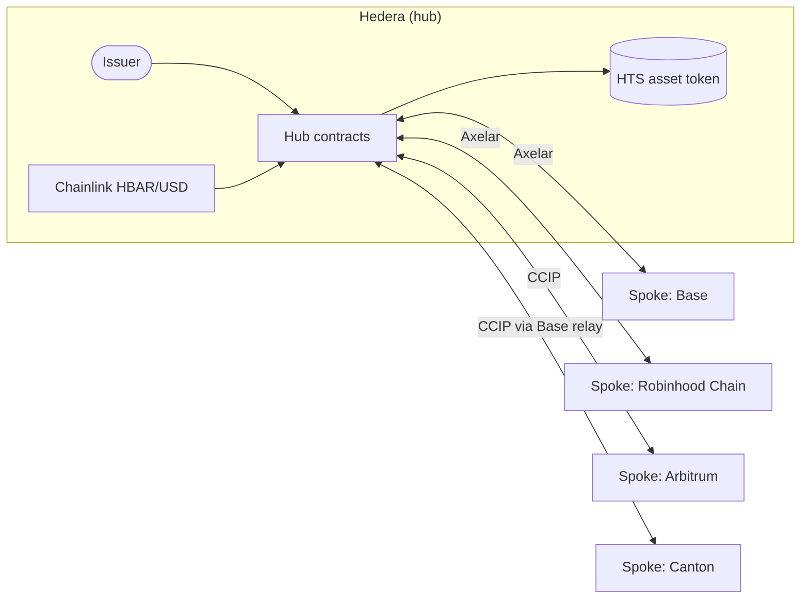

# Architecture

Atollway lets an issuer create one tokenized asset on Hedera and offer it on other chains, while compliance, pricing and servicing stay on Hedera.

> **Status:** design. The contracts are being built in the order shown in the [roadmap](roadmap.md). The decisions behind this design are recorded in [`docs/adr`](adr/README.md).

## Overview

The **hub** on Hedera issues the asset, keeps the investor register and the supply ledger, and prices subscriptions. Each **spoke** on another chain holds a mirror of the asset, minted only by the hub. **Transport adapters** carry messages between the hub and the spokes over Axelar or Chainlink CCIP.

## Components

### Hub (Hedera)

| Component | Responsibility |
| --- | --- |
| Asset token | Fungible HTS token. The hub contract holds its KYC, freeze, pause, wipe and supply keys and is its treasury ([ADR-0002](adr/0002-hts-asset-token.md)). |
| Investor register | Approves, freezes and revokes investors by EVM address ([ADR-0004](adr/0004-evm-address-identity.md)). Applies the decision to the HTS token on Hedera and sends it to every spoke. |
| Subscriptions | Investors buy shares with HBAR at the net asset value (NAV) the issuer sets. HBAR is valued in US dollars with the Chainlink HBAR/USD feed. |
| Spoke registry | Each spoke's chain, address, transport adapter and supply cap ([ADR-0005](adr/0005-spoke-supply-caps.md)). |
| Supply ledger | How much of the asset is outstanding on each spoke. |
| Message router | Encodes outgoing messages, hands them to the spoke's adapter, and accepts incoming messages only from registered spokes. |

### Spokes (other chains)

| Component | Responsibility |
| --- | --- |
| Spoke token | ERC-20 mirror of the asset. Only the spoke gateway can mint or burn it. Both sender and receiver of a transfer must be approved, and transfers stop while the spoke is paused. |
| Spoke gateway | Applies the hub's compliance decisions, mints incoming transfers, burns tokens sent back to Hedera, and lets a local guardian pause the spoke immediately. |

### Transports

| Component | Responsibility |
| --- | --- |
| Transport adapter | One per bridge: Axelar General Message Passing or Chainlink CCIP. Sends messages and checks the source of incoming ones before passing them to the hub or a gateway ([ADR-0003](adr/0003-axelar-and-ccip-transports.md)). |
| Base relay | Forwards CCIP messages between Hedera and chains with no direct CCIP lane to Hedera, such as Canton. |

## Glossary

| Term | Meaning |
| --- | --- |
| Hub | The contracts on Hedera that issue and service the asset. |
| Spoke | The contracts on another chain that hold a mirror of the asset. |
| Outstanding amount | How much of the asset currently sits on a given spoke, as recorded by the hub. |
| Cap | The maximum outstanding amount the hub allows for a spoke. |
| NAV | Net asset value per share, in US dollars, set by the issuer. |
| Transfer ID | A unique identifier for one movement of supply between Hedera and a spoke. |
