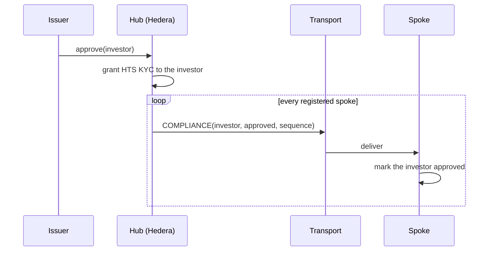
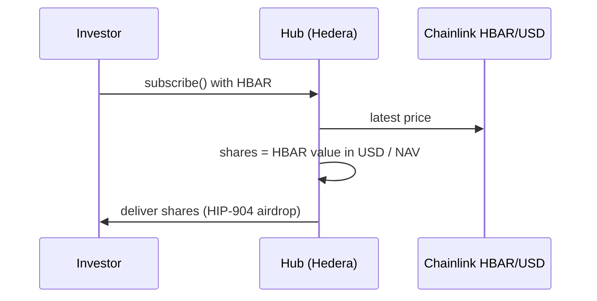
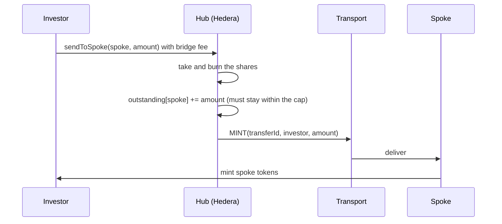
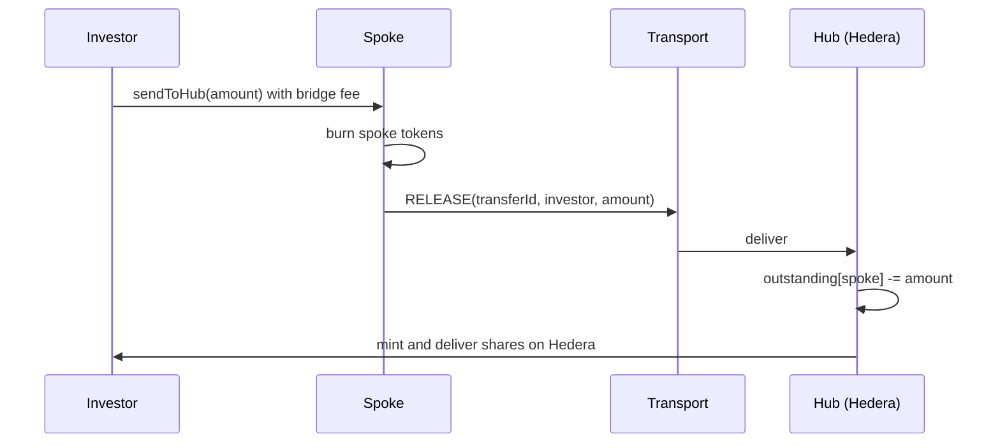

# Architecture

Atollway lets an issuer create one tokenized asset on Hedera and offer it on other chains, while compliance, pricing and servicing stay on Hedera.

> **Status:** design. The contracts are being built in the order shown in the [roadmap](roadmap.md). The decisions behind this design are recorded in [`docs/adr`](adr/README.md).

## Overview

The **hub** on Hedera issues the asset, keeps the investor register and the supply ledger, and prices subscriptions. Each **spoke** on another chain holds a mirror of the asset, minted only by the hub. **Transport adapters** carry messages between the hub and the spokes over Axelar or Chainlink CCIP.

## Components

### Hub (Hedera)

| Component | Responsibility |
| --- | --- |
| Asset token | Fungible HTS token. The hub contract holds its KYC, freeze, pause, wipe and supply keys and is its treasury ([ADR-0002](adr/0002-hts-asset-token.md)). |
| Investor register | Approves, freezes and revokes investors by EVM address ([ADR-0004](adr/0004-evm-address-identity.md)). Applies the decision to the HTS token on Hedera and sends it to every spoke. |
| Subscriptions | Investors buy shares with HBAR at the net asset value (NAV) the issuer sets. HBAR is valued in US dollars with the Chainlink HBAR/USD feed. |
| Spoke registry | Each spoke's chain, address, transport adapter and supply cap ([ADR-0005](adr/0005-spoke-supply-caps.md)). |
| Supply ledger | How much of the asset is outstanding on each spoke. |
| Message router | Encodes outgoing messages, hands them to the spoke's adapter, and accepts incoming messages only from registered spokes. |

### Spokes (other chains)

| Component | Responsibility |
| --- | --- |
| Spoke token | ERC-20 mirror of the asset. Only the spoke gateway can mint or burn it. Both sender and receiver of a transfer must be approved, and transfers stop while the spoke is paused. |
| Spoke gateway | Applies the hub's compliance decisions, mints incoming transfers, burns tokens sent back to Hedera, and lets a local guardian pause the spoke immediately. |

### Transports

| Component | Responsibility |
| --- | --- |
| Transport adapter | One per bridge: Axelar General Message Passing or Chainlink CCIP. Sends messages and checks the source of incoming ones before passing them to the hub or a gateway ([ADR-0003](adr/0003-axelar-and-ccip-transports.md)). |
| Base relay | Forwards CCIP messages between Hedera and chains with no direct CCIP lane to Hedera, such as Canton. |

## Glossary

| Term | Meaning |
| --- | --- |
| Hub | The contracts on Hedera that issue and service the asset. |
| Spoke | The contracts on another chain that hold a mirror of the asset. |
| Outstanding amount | How much of the asset currently sits on a given spoke, as recorded by the hub. |
| Cap | The maximum outstanding amount the hub allows for a spoke. |
| NAV | Net asset value per share, in US dollars, set by the issuer. |
| Transfer ID | A unique identifier for one movement of supply between Hedera and a spoke. |

## Message flows

Every cross-chain message uses the same envelope: a format `version` (currently 1), a message `kind`, and a kind-specific `payload`.

| Kind | Direction | Payload | Effect on arrival |
| --- | --- | --- | --- |
| `COMPLIANCE` | hub → spoke | account, status, sequence | The spoke records the investor's new status if the sequence is newer than the last one it applied for that investor. |
| `MINT` | hub → spoke | transfer ID, recipient, amount | The spoke mints to the recipient, once per transfer ID. |
| `RELEASE` | spoke → hub | transfer ID, recipient, amount | The hub releases shares on Hedera, once per transfer ID and up to the spoke's outstanding amount. |
| `PAUSE` | hub → spoke | paused flag | The spoke stops or resumes transfers. |

Whoever starts a flow pays the bridge fee in the source chain's native token: the issuer for compliance and pause messages, the investor for transfers.

### Approving an investor

Freezing and revoking follow the same path. On Hedera, freezing uses the token's freeze key and revoking removes the investor's KYC.

### Subscribing

Only approved investors can subscribe. The hub rejects the subscription if the price feed is older than a configured limit.

### Sending shares to a spoke

### Returning shares to Hedera

## Trust model

| Party | Trusted for | If it fails or misbehaves |
| --- | --- | --- |
| Issuer | Approving investors, setting the NAV and caps, pausing | The issuer controls the asset by design. In production, use a multisig or a Hedera threshold key. |
| Hedera network | Token rules, ordering, scheduled execution | Atollway inherits Hedera's security. |
| Bridge (Axelar or CCIP) | Delivering authentic messages between the hub and spokes | A forged message can mint at most the remaining cap on spokes bound to that bridge, or release on Hedera at most those spokes' outstanding amounts ([ADR-0005](adr/0005-spoke-supply-caps.md)). |
| Chainlink price feed | The HBAR/USD price | A wrong price mis-prices subscriptions. Subscriptions stop when the feed is older than the configured limit. |

## Failure modes

| Situation | What happens | Mitigation |
| --- | --- | --- |
| A compliance message is delayed | A revoked investor can still move tokens on that spoke until the message arrives, usually within minutes. | For urgent cases, the spoke's local guardian pauses the spoke immediately, without waiting for the bridge. |
| Messages arrive out of order | An older compliance status could overwrite a newer one. | Compliance messages carry a per-investor sequence number, and spokes ignore older ones. |
| A message is delivered twice | A transfer could be applied twice. | The hub and every spoke accept each transfer ID once. |
| A message is never delivered | Shares burned on Hedera are recorded as outstanding but not yet minted on the spoke. | Nothing is lost: the hub's ledger still holds the amount, and anyone can retry execution from Axelarscan or the CCIP Explorer. |
| A bridge is compromised | Forged `MINT` or `RELEASE` messages arrive. | Supply caps limit the damage. The issuer pauses the hub and the affected spokes and unregisters the adapter. |
| The price feed is stale | Subscriptions would use an old price. | The hub rejects subscriptions while the feed is older than the configured limit. |

The contracts are unaudited. See [SECURITY.md](../SECURITY.md) before using them with real assets.
